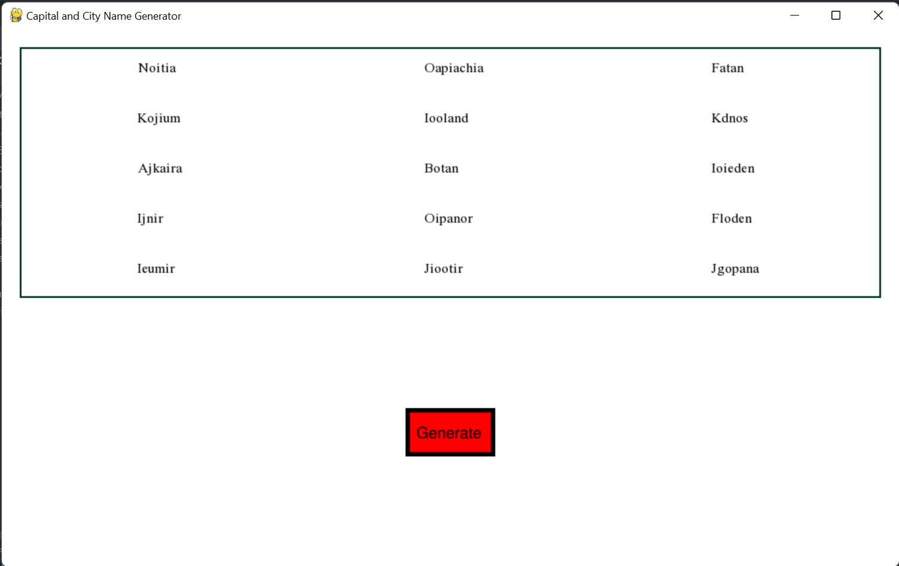

# Capital-and-City-Name-Generator
A weekend project for a Fantasy Name Generator

## Description
The Capital and City Name Generator was designed as a short project to solve the issue of uninteresting name generators
that currently exist. Some names generated by this project may make no sense, however, these names make for interesting
inspiration.

The project also consists entirely of python. The main focus of the program focused on learning the pygame module. The 
generator is rather simple by choosing random consonants and vowels to construct a prefix then choosing suffix from a
list of suffixes. The main script utilizes the generator to generate and output 15 names to the pygame screen.

## Visuals
