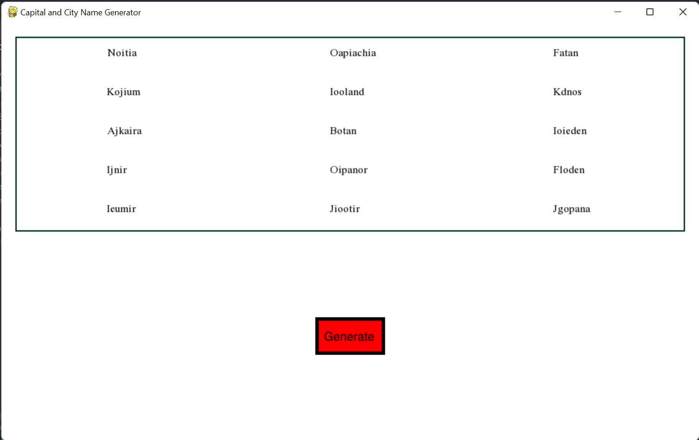

# Capital-and-City-Name-Generator
A weekend project for a Fantasy Name Generator.

## Description
The Capital and City Name Generator was designed as a short project to solve the issue of uninteresting name generators
that currently exist. Some names generated by this project may make no sense, however, these names make for interesting
inspiration.

The project also consists entirely of python. The main focus of the program focused on learning the pygame module. The 
generator is rather simple by choosing random consonants and vowels to construct a prefix then choosing suffix from a
list of suffixes. The main script utilizes the generator to generate and output 15 names to the pygame screen.

## Visuals


## Installation
In order to properly run this program Python will need to be installed. You can download Python for free from their
official website [here](https://www.python.org/downloads/). **IMPORTANT**: Python must be installed for all users and
**MUST** be added to the PATH.

Now open the command terminal and enter the following _pip_ command:
```commandline
pip install pygame
```

After Python and pygame have been downloaded click the green code button in the GitHub Repository and **Download Zip**.

Once the zip file has been downloaded extract all to the destination of your choice.

In the extracted folder will be a shortcut which you can drag to your desktop. If you would like to change the shortcut
icon to the custom icon go to the [SHORTCUT INSTRUCTIONS](SHORTCUT%20INSTRUCTIONS.md) in the project folder.

After you have dragged the shortcut to your desktop double-click it. A prompt will then display asking what you want to
use to open **.pyw** files. **IMPORTANT**: You must select the python interpreter and not an IDE for it too properly run.

The shortcut should now be configured to be used at anytime.

## Usage
Once you have the application open and running click the red button to generate a list of 15 names in the display box.

## Support
Ways you can reach me:
- [Join the discord server](https://discord.gg/mTyQrpFFxY)
- [Start a discussion in the discussion tab of the repository](https://github.com/OsmiumCoder/Capital-and-City-Name-Generator/discussions)
- [Or send me a DM on Twitter](https://twitter.com/Jonathon_Meney)

## Roadmap
Planned Changes:
1. Package into exe.
2. Revamp prefix code dictionary to function like a binary number
3. Add additional suffixes to existing library
4. Add a prefix library
5. Rework name generation to create names with more pronounceable prefixes
6. Possibly add type hinting in more places

## Contributing
Pull requests are welcome, though may not always be accepted. For major changes, please open an issue first to discuss 
what you would like to change.

## Authors and acknowledgment
Me: [Jonathon Meney](https://github.com/OsmiumCoder)

## License
_Capital-and-City-Name-Generator_ falls under the [MIT](https://choosealicense.com/licenses/mit/) license
